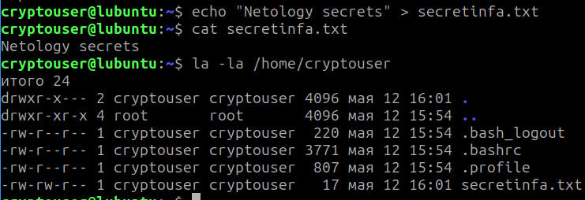
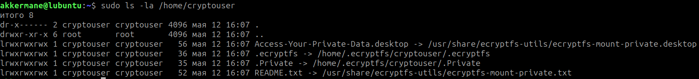
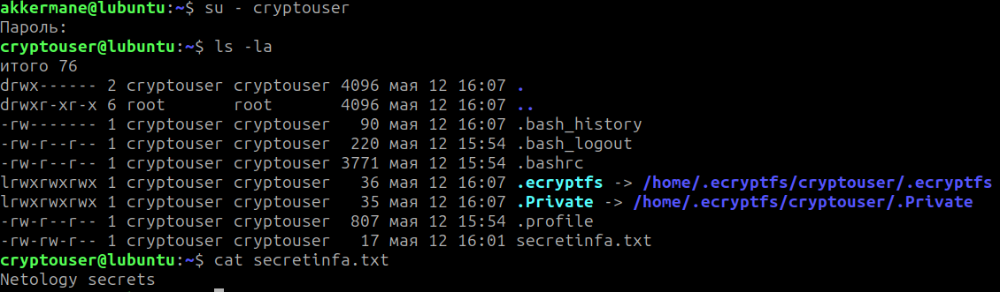
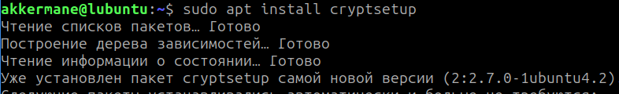
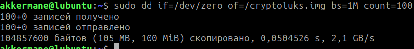
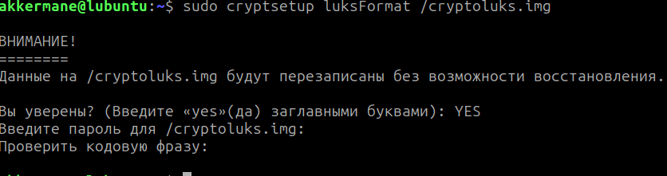
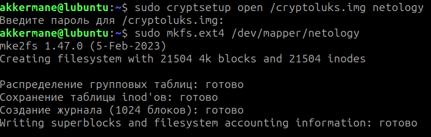
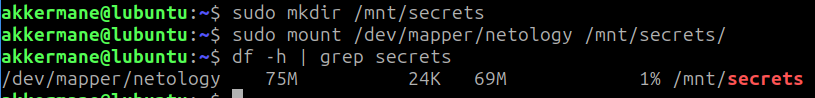

# Домашнее задание к занятию "`Защита хоста`" - `Евдокимов Евгений Игоревич`

### Задания 

Задание 1

    Установите eCryptfs.
    Добавьте пользователя cryptouser.
    Зашифруйте домашний каталог пользователя с помощью eCryptfs.

В качестве ответа пришлите снимки экрана домашнего каталога пользователя с исходными и зашифрованными данными.

Задание 2

    Установите поддержку LUKS.
    Создайте небольшой раздел, например, 100 Мб.
    Зашифруйте созданный раздел с помощью LUKS.

В качестве ответа пришлите снимки экрана с поэтапным выполнением задания.

Дополнительные задания (со звёздочкой*)
Эти задания дополнительные, то есть не обязательные к выполнению, и никак не повлияют на получение вами зачёта по этому домашнему заданию. Вы можете их выполнить, если хотите глубже шире разобраться в материале

Задание 3 

    Установите apparmor.
    Повторите эксперимент, указанный в лекции.
    Отключите (удалите) apparmor.

В качестве ответа пришлите снимки экрана с поэтапным выполнением задания.

### Решение

Задание 1 

Создаем пользователя, создаем рандомный файл, и смотрим вывод этого файла, а так же домашнего каталога

Зашифровываем каталог пользователя и теперь смотрим вывод команды la-la на его каталоге

Теперь заходим под зашифрованным пользователем и смотрим вывод еще раз

Задание 2

Устанавливаем программу для работы с LUKS, в моем случае она уже была установленна в системе

Создаем раздел для проведения работы

Инициализируем LUKS контейнер

Заходим в контейнер и создаем в нем файловую систему 

Монтируем данный раздел, чтобы увидеть, что он работаспособен

